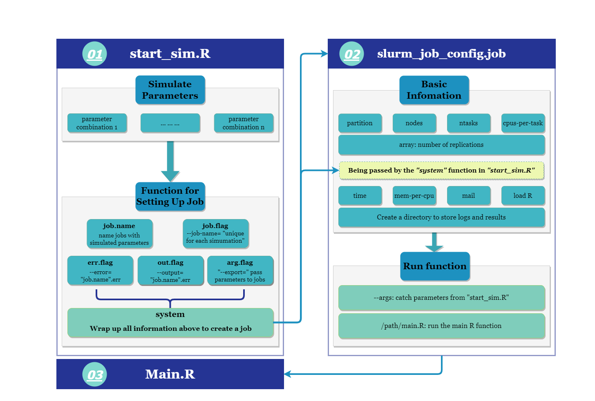

<!-- README.md is generated from README.Rmd. Please edit that file -->

# Automating R Simulation Studies

<!-- badges: start -->
<!-- badges: end -->

The goal of this repository is to provide
[`R`](https://www.r-project.org/) users an example of how to **automate
simulation studies on high-performance computing platforms (a.k.a. the
cluster)**. The pipeline was initially written for
[`Slurm`](https://slurm.schedmd.com/documentation.html) scheduling
system, but can be easily modified for other systems.

The main idea of this pipeline is to use R to compose jobs via system
call, where each job corresponds to a batch of replications under the
same simulation setting. These replications are implemented via the
Slurm *job array* feature using the flag
[`--array`](https://slurm.schedmd.com/job_array.html).

## Toy Example: Central Limit Theorem

We use a simulation study of the central limit theorem (CLT) to
demonstrate the pipeline. In this example, we simulate random samples
(*X*1, …, *X**n*) of size
*n* ∈ {5, 10, 50, 100, 500, 1000, 5000, 10000} from independent and
identical Poisson distribution with mean *λ* = 3, and calculate the
sample mean *X̄* of the *n* random sample. This process is repeated for
100000 times to generate a empirical distribution of *X̄*. We hypothesize
this empirical distribution should closely match to a normal
distribution of mean 3 and variance 3, particularly when *n* grows
larger. To examine our hypothesis, we record the mean, median, variance
of the empirical distribution. This concludes as one replication, and we
have *n*it = 1000 replications for each setting of *n*.

To put the simulation study in the context of the pipeline, we have

-   one simulation parameter: the size of random samples *n*  
-   the data generating process: 1000 samples of
    (*X*1, …, *X**n*) where
    *X**i* ∼ Poisson(*λ* = 3) i.i.d. for *i* = 1, …, *n*  
-   the model and its output: the empirical distribution of *X̄* and its
    mean, median, variance
-   the number of replications for each simulation setting:
    *n*it = 1000

### Getting Started

1.  Copy three code files (including `start_sim.R`,
    `slurm_job_config.job`, `main.R`) in the folder `Code-copy_me` to
    your working directory on the cluster.

2.  Replace the code section \[TODO: insert permanent link here\] in the
    `main.R` file with you simulation code

3.  Replace the directory paths with your preferred path

    -   [Global
        search](https://support.rstudio.com/hc/en-us/articles/200710523-Navigating-Code)
        the phrase `TODO: Replace path here` in the code files
    -   We recommend to use [absolute path instead of relative
        path](https://www.linux.com/training-tutorials/absolute-path-vs-relative-path-linuxunix/)
        in your files

4.  In the log-in node of the cluster, source the file `start_sim.R` in
    an R console or run `R CMD BATCH start_sim.R` in the command line
    within your working directory, i.e. the directory that contains the
    three code files

    -   You still need to load the R module before running the R script
        in your preferred way.

5.  Wait to see the simulation output in the designated storage
    folder/directory

    -   If there was something wrong with the simulation, go to your log
        folder/directory

### Homework

As a practice that helps you familiarize with the pipeline, please
consider to improve the current simulation study by

-   considering more simulation parameters, e.g. more options of the
    sample distribution *X**n*
-   replicating the simulation study for *n*it ∈ {100, 10000}
    times per each simulation setting
-   summarizing the empirical distribution of *X̄* differently,
    e.g. kurtosis, skewness, or normality test

## Technical Explanation

The pipeline is built upon the premise that running each repetition via
different jobs (i.e. 1000 jobs where each job requires a single core on
a node) is more efficient than running all repetitions within a giant
loop that has some parallel capacity (i.e. 1 job that requires 1 node
with 44 CPUs and 2 days of computation time). This is generally true
when you can create more jobs (without long queuing time) than the
number of cores that available for use. In addition, it takes a lot
longer time to request a single node with a great number of CPUs.

The main idea of the pipeline is to create an R interface `sim_start.R`
where you can set up parameters of the simulation study. Then, the R
interface will help to create job arrays via `sys.call`. Each simulation
setting has a job array that contains independent replications of
preferred size. The parameters that are necessary to create a simulation
setting is passed to the job scheduling script `slurm_job_config.job`
and further to the R code `main.R` that contains the data generating
process. In other words, we can use the same job script and data
generating process with different sets of simulation parameters.

## Questions/Discussion Board

Please feel free to ask us questions or report bugs via
[Issues](https://github.com/boyiguo1/Tutorial-Sim_Cluster_Composer/issues)
tab of the repository. We advise you to search if a similar question or
bug was previously issued before filing your own. You can search and
filter by using the search box or the labels. Two templates are provided
to report, where you need to describe your problem and provide a minimal
reproducible example.

## Related Resources

### Simulation Strategies

-   Modulize your code
-   Test out your code before deployment on the cluster
-   Choose the correct partition
-   Raw Data Vs Simulation Results
-   Trade-offs: Change parameters of the jobs

### Other Tools

-   Use `Targets`

### Design Your Simulation Study

-   Add Morris, White, Crowther (2017) Stat in Med Paper
